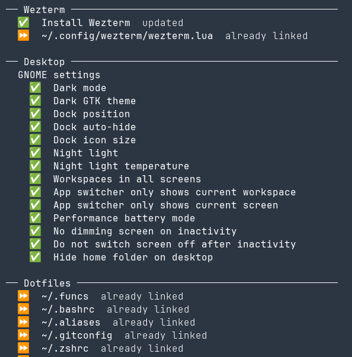

Recently I finished a 2-month project, and as I always do between projects I wiped my machine. Next I of course needed to setup my machine with all my configurations and tooling, which I'd typically do by running my dotfiles. But, my dotfiles are a bit old and borked, and since I'm on the bench now... I figured, why not do a bit of [bike shedding](https://thedecisionlab.com/biases/bikeshedding)?

The goal of my new dotfiles is largely the same as before: Deterministic(ish) machine configuration. I should be able to run a single command, type in my password, and have almost all the usual setup and configuration I'd need for my day-to-day work done, just like that. When something breaks, I should be able to look through the history of my dotfiles to see when certain configuration changes were introduced and why. In short, it should be a source of 'development environment as code'.

It is common wisdom that you should practice the parts of your work that are unfamiliar or infrequent, so that you are fully prepared when the time comes that you need them. You can see this principle in [chaos engineering](https://en.wikipedia.org/wiki/Chaos_engineering), in which we try to become more comfortable with disaster recovery and make such practices a normal day-to-day event, so that we'll be perfectly comfortable and ready when a big disaster outside of our control comes along. I think of my development environment the same way: I frequently wipe my machine and automate my configuration because I want to be extremely comfortable setting it up again quickly. It shouldn't be a time-consuming ordeal to swap to a new machine, or to reset yours for one reason or another. 

My original implementation was very much inspired by [Adam Eivy's dotfiles](https://github.com/atomantic/dotfiles). But the Bash version I'd hacked together using bits and pieces from Adam's repo didn't hold up, it seemed to drift quickly and often presented awkward weird bugs as you'd expect from Bash. The functions for printing the output weren't very well encapsulated so different steps might behave significantly differently. It just wasn't very maintainable or easy to work with. I'd had the idea in mind for a while to rewrite this in Python, and here it is: 



It isolates each individual setup step, grouping related ones together but printing out the results of individual steps as soon as they are finished, so you get immediate feedback. Icons indicate success,  skip, or failure. Steps should be idempotent, and skip execution if they can detect that they've already run. Console output is swallowed, unless an error occurs:

<figure src="dotfiles-output-error.png" width="600px"></figure>   

This way, when I run the thing some years down the line and some step has inevitably broken as software changes and times change, I can clearly see what is going on.

## The code

The code lives [here](https://github.com/mattsi-jansky/dotfiles.new) and is separated into core/framework code, steps, and home files:

```bash
.
├── config      # configuration files for specific apps
├── framework   # Pretty printing, abstractions around 'steps', core logic
├── home        # home dir dotfiles (`.bashrc`, etc)
├── steps       # The individual steps to run during setup
└── tests       # Tests for the framework
```

To add a new step you can write any arbitrary code inside a `runner` decorator: 

```python
@runner.step(group="Nushell", name="Install Nushell")
def install_nushell() -> Result:
    return cargo_install("nu")
```

You return a result, and the framework formats and prints it for you. You can pass `interactive=True` to mark a step as needing interactivity (i.e. the step needs user input), and `group` groups different steps together under headers. For actually doing something inside your steps there are several helper functions or 'providers' for doing common things like installing apt, snap or cargo packages, creating symbolic links, or running shell commands and interpreting the results.

## Automatically registering GitHub SSH keys

I find an intrinsic pleasure in automating something that would otherwise be an awkward inconvenience ([XKCD 1319](https://xkcd.com/1319/) not withstanding), and one of those inconveniences is creating a new SSH key every time I setup a new development environment. I want to start exploring GitHub alternatives more, but for now it is what I use, and so I automated away this dull task using GitHub CLI.

I have a step that generates an SSH key, an interactive step that ensures you are authorised with GitHub CLI, and a step that uses the GitHub CLI to upload your SSH key for you. I don't doubt that I won't win back the amount of time spent doing this for years if not decades but it was very satisfying to run my dotfiles then push to my dotfiles over SSH, without ever setting up a key manually. I just wanted to highlight that because I'm particularly happy with it.

## Conclusion

Solved! I'm sure I'll never have to worry about machine configuration again, right? ...Right?

If this sounds cool to you too, feel free to have a play with [the code](https://github.com/mattsi-jansky/dotfiles.new).
